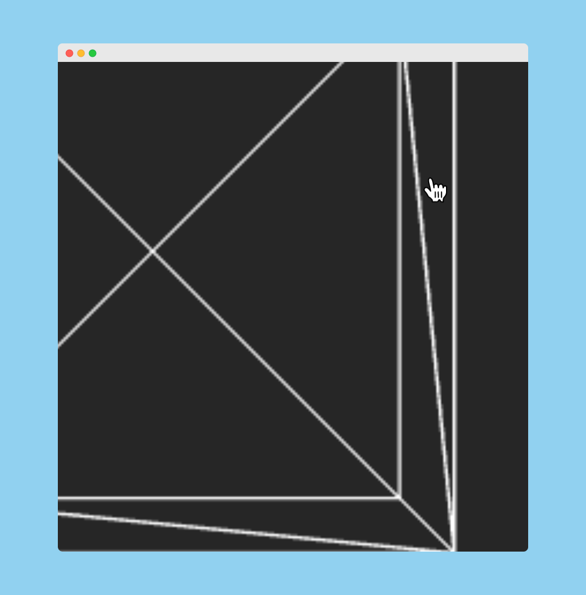

# THREE.JS - RESPONSIVE DESIGN

On resizing the screen, you can observe that the scene is not responsive. Making a webpage responsive generally refers to the page displaying well on different sized displays from desktops to tablets to phones. In this chapter, you are going to see how to solve some basic problems of your Three.js app.

## Automatically resize the output when the browser size changes

When you resize the browser, we have to notify the Three.js so that it knows how wide the `<canvas>` element should be. For the camera, we need to update the aspect property, which holds the aspect ratio of the screen, and for the renderer, we need to change its size.

```js
window.addEventListener('resize', () => {
  // update display width and height
  width = window.innerWidth
  height = window.innerHeight

  // update camera aspect
  camera.aspect = width / height
  camera.updateProjectionMatrix()

  // update renderer
  renderer.setSize(width, height)
  renderer.setPixelRatio(Math.min(window.devicePixelRatio, 2))
  renderer.render(scene, camera)
})
```

The above code creates responsiveness to your Three.js project.

## Anti-aliasing


> The **aliasing effect** is the appearance of jagged edges or "jaggies"(also known as stair-stepped lines) on edges and objects (rendered using pixels).

Aliasing in our `Hello cube` app.


We can turn on anti-aliasing by setting `antialias` property of the `WebGLRenderer` to `true`, by default it is set to `false`. Here, we will set the `antialias` parameter to `true`:

```js
const renderer = new WebGLRenderer({ antialias: true })
renderer.physicallyCorrectLights = true
```

After `anti-aliasing`, it looks like this.



The property `physicallyCorrectLights` tells Three.js whether to use physically correct lighting mode. Default is `false`. Setting it to `true` will help increase the detail of the object.